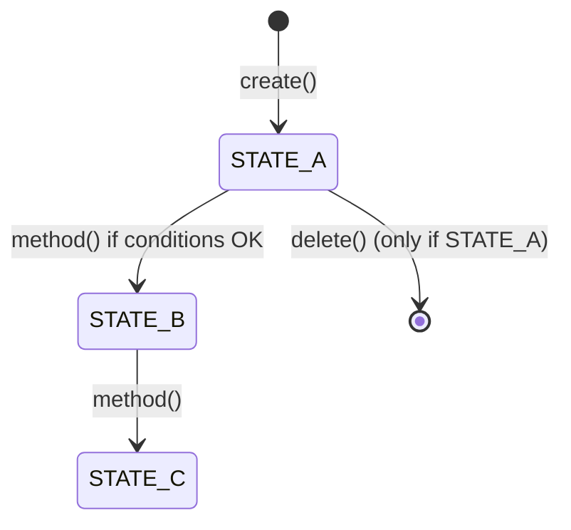
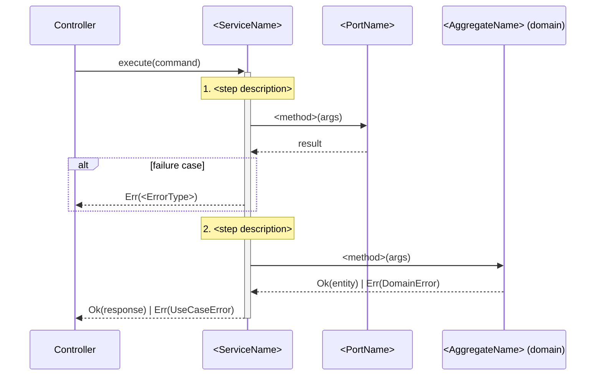
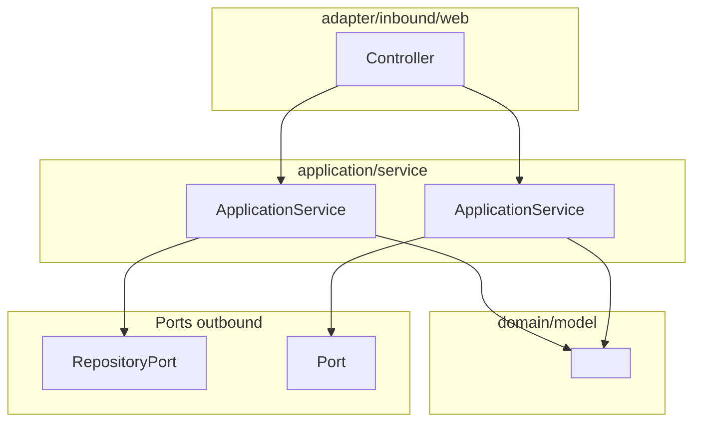

# Behavior Documentation Format — BDD (Behavior-Driven Documentation)

Reference format for the `document-backend-code` skill.
Apply this template when generating or updating `docs/domains/<domain>-behavior.md`.

---

## File naming & location

```
docs/
└── domains/
    ├── <domain>-behavior.md     ← one file per business domain
    └── cross-domain.md          ← only if many inter-domain interactions (optional)
```

---

## Complete Template

```markdown
# Domain: <DomainName>

> **Responsibility**: <one-sentence description of what this domain owns>
> **Aggregates**: `<Aggregate1>`, `<Aggregate2>`, ...
> **Status**: Active since <version or date if known>

---

## Overview

<2–4 sentences describing what the domain does, its main invariants, and its key lifecycle.>

Key business rules:
- ✅ **<Rule 1>**: <short description>
- ✅ **<Rule 2>**: <short description>
- ✅ **<Rule N>**: ...

---

## Domain Model

### Primary Aggregate: `<AggregateName>`

#### Construction rules
| Rule | Invariant | Error returned |
|------|-----------|----------------|
| <rule> | `<code condition>` | `DomainError.<ErrorCase>` |

#### State machine (if applicable)


#### Key domain methods
<!-- Include only methods with non-trivial business logic -->

##### `<methodName>(<params>): Result<T, E>`

**Pre-conditions:**
- <condition 1>

**Validation rules:**
1. ❌ If `<condition>` → `DomainError.<Case>`
2. ❌ If `<condition>` → `DomainError.<Case>`

**Post-conditions:**
- <what is guaranteed after success>

**Domain events emitted:** <`EventName(fields)` or "none">

---

## Use Cases (Application Layer)

<!-- Sort by complexity: simple ones first with summary table, complex ones with full detail -->

### 🟢 Simple Use Cases — Summary

| Use Case | Summary | Inputs | Errors | Dependencies |
|----------|---------|--------|--------|--------------|
| `CreateXxxApplicationService` | <one-line> | `XxxCommand(field1, field2)` | `NotFound` (404), `InsufficientPermissions` (403) | `XxxRepositoryPort`, `UserPort` |
| `ListXxxApplicationService` | <one-line> | `ListXxxQuery(groupId, page, size)` | `InsufficientPermissions` (403) | `XxxRepositoryPort` |

---

### 🔴 Complex Use Cases — Detailed

#### `<ComplexUseCaseApplicationService>`

**Summary:** <1–2 sentences explaining why it is complex and what it orchestrates.>

**Nominal flow:**



**Business rules applied:**
| Step | Rule | Error | HTTP |
|------|------|-------|------|
| 1 | <rule description> | `UseCaseError.<Case>` | 403 |
| 2 | <rule description> | `UseCaseError.<Case>` | 404 |

**Dependencies:**
- `<PortName>` — <purpose>
- `<PortName>` — <purpose>

**Edge cases / attention points:**
- ⚠️ **<Point>**: <explanation>

---

## Cross-Domain Interactions

<!-- Only if this domain calls into another domain via outbound ports -->

### `<ThisDomain>` → `<OtherDomain>`

| Outbound Port | Adapter | Responsibility |
|---------------|---------|----------------|
| `<PortInterface>` | `<AdapterClass>` | <what data is needed from the other domain> |

**Typical call chain:**
```
<UseCase>
  → <OutboundPort>.<method>(...)
    → <AdapterClass>.<method>(...)
      → <TargetUseCase>.execute(...)
```

---

## Error Reference

| `UseCaseError` | HTTP | Description |
|----------------|------|-------------|
| `InsufficientPermissions` | 403 | User lacks required permission |
| `<DomainEntityNotFound>` | 404 | Entity not found for this groupId |
| `<EntityNotDraft>` | 422 | Operation only allowed in DRAFT status |
| `ConcurrentModification` | 409 | Aggregate version mismatch (optimistic lock) |
| `DomainValidation` | 400 | General domain validation failure |

---

## Architecture Diagram



---

## Documentation Changelog

| Date | Version | Author | Changes |
|------|---------|--------|---------|
| <date> | 1.0 | document-backend-code skill | Initial documentation generated |
```

---

## Section filling rules

### When to include each section

| Section | Include when |
|---------|-------------|
| **State machine diagram** | Aggregate has ≥ 2 distinct states with transition logic |
| **Key domain methods** | Method has ≥ 2 validation conditions OR accumulates errors |
| **Complex use case detail** | Use case meets complexity heuristics (see `complexity-heuristics.md`) |
| **Cross-domain interactions** | Domain has ≥ 1 outbound port in `application/port/outbound/` targeting another domain |
| **Architecture diagram** | Domain has ≥ 3 use cases OR complex cross-domain wiring |
| **Sequence diagram** | Use case classified as 🔴 complex |

### Detail level rules

| Element | Simple 🟢 | Complex 🔴 |
|---------|-----------|-----------|
| Use case description | One-row table entry | Full section with sequence diagram |
| Business rules | "Errors" column in table | Detailed table (Step / Rule / Error / HTTP) |
| Dependencies | Listed in table cell | Bullet list with purpose per port |
| Edge cases | Not shown | ⚠️ bullet points |

---

## Real examples

### Simple use case row (workflow domain)
```markdown
| `ListWorkflowsApplicationService` | Returns paginated list of workflows for the group | `ListWorkflowsQuery(groupId, page, size)` | `InsufficientPermissions` (403) | `WorkflowRepositoryPort` |
```

### Complex use case: `CreateCustomFieldApplicationService`
This use case is complex because it:
- Performs a cross-domain check (StandardFieldRepositoryPort — slug conflict)
- Applies domain validation in 2 stages (CustomField.create → workflow.addCustomField)
- Has 7 distinct error cases across 4 HTTP status codes (400, 403, 404, 409, 422)
- Has a race condition risk at persistence (optimistic lock)

→ Deserves a full section with sequence diagram and business rules table.

### Simple use case: `GetWorkflowApplicationService`
This use case is simple because it:
- Has 1 permission check + 1 repository lookup
- Has only 2 error cases (InsufficientPermissions, WorkflowNotFound)

→ One row in the summary table is sufficient.
