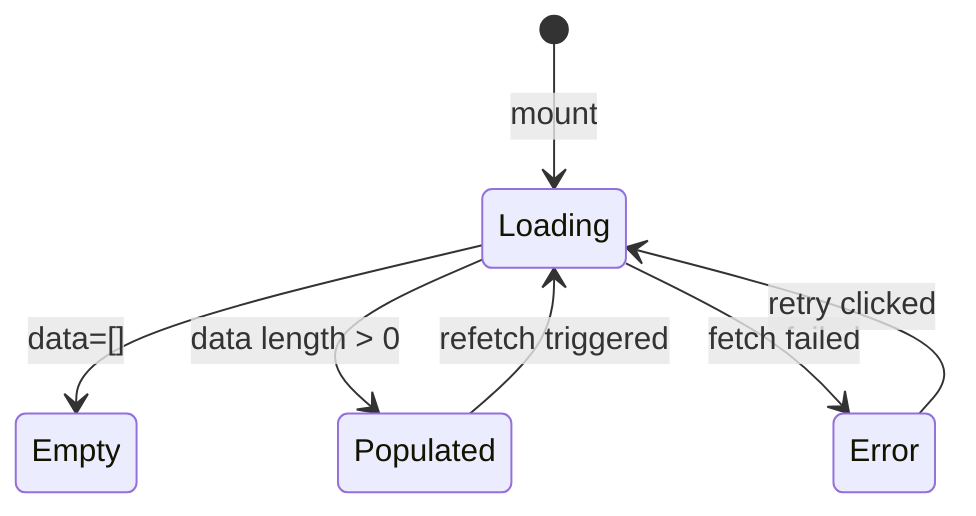

# Vue Component Documentation Format — BDD (Behavior-Driven Documentation)

Reference format for the `document-frontend-code` skill.
Apply this template when generating or updating `docs/frontend/<area>-components.md`.

---

## File naming & location

```
docs/
└── frontend/
    ├── <area>-components.md     ← one file per feature area
    ├── composables.md           ← all composables (or per-domain composable file)
    └── stores.md                ← Pinia store documentation
```

---

## Complete Template

```markdown
# Frontend: <AreaName>

> **Scope**: <pages, components, or feature area covered>
> **Stack**: Vue 3 / Nuxt 4 / PrimeVue / Tailwind

---

## Overview

<2–3 sentences describing the area, its main UI patterns, and its key interactions.>

---

## Components

### 🟢 Simple Components — Summary

| Component | Responsibility | Props | Emits | Used by |
|-----------|---------------|-------|-------|---------|
| `AppButton.vue` | Reusable CTA with loading state | `label`, `loading`, `disabled` | `click` | — |
| `StatusBadge.vue` | Renders workflow status as colored chip | `status: WorkflowStatus` | — | `WorkflowList.vue` |

---

### 🔴 Complex Components — Detailed

#### `<ComponentName>.vue`

**Summary:** <1–2 sentences explaining why it is complex and what it orchestrates.>

**Props:**
| Prop | Type | Required | Default | Description |
|------|------|----------|---------|-------------|
| `items` | `WorkflowItem[]` | ✅ | — | List to display |
| `loading` | `boolean` | ❌ | `false` | Shows skeleton rows |
| `groupId` | `string` | ✅ | — | Scopes data to this group |

**Emits:**
| Event | Payload | When fired |
|-------|---------|-----------|
| `select` | `WorkflowItem` | User clicks a row |
| `delete` | `string` (id) | User confirms deletion dialog |

**Slots:**
| Slot | Description |
|------|-------------|
| `actions` | Custom action buttons injected per row |

**Composables used:**
- `useWorkflows(groupId)` — fetches and caches workflow list
- `usePermissions()` — guards delete/archive actions

**Interaction states:**


**Edge cases / attention points:**
- ⚠️ **Optimistic delete**: row removed from UI before API confirms — re-inserted on error
- ⚠️ **Empty state**: shows illustration + CTA, not just "No results"

---

## Composables

### Summary table

| Composable | Inputs | Returns | Side effects |
|------------|--------|---------|--------------| 
| `useWorkflows(groupId)` | `groupId: string` | `{ data, isLoading, error, refetch }` | TanStack Query cache |
| `usePermissions()` | — | `{ can(action, resource): boolean }` | Reads auth store |

### Complex composable: `use<Name>()`

**Signature:** `useName(param: Type): ReturnType`

**Parameters:**
- `param` — <description and expected shape>

**Returns:**
- `data` — <description and type>
- `isLoading` — `boolean`, true while async operation is pending
- `error` — error object if failed, `null` otherwise

**Side effects:**
- <watcher, store write, localStorage, etc.>

**Usage example:**
```typescript
const { data, isLoading } = useName(props.id)
```

---

## Pinia Stores

### `use<Name>Store`

**State:**
| Field | Type | Description |
|-------|------|-------------|
| `items` | `WorkflowItem[]` | Loaded workflow list |
| `currentId` | `string \| null` | Currently selected workflow ID |

**Getters:**
| Getter | Returns | Description |
|--------|---------|-------------|
| `current` | `WorkflowItem \| undefined` | Item matching `currentId` |
| `count` | `number` | Total item count |

**Actions:**
| Action | Params | Description |
|--------|--------|-------------|
| `load(groupId)` | `groupId: string` | Fetches and replaces `items` |
| `setCurrent(id)` | `id: string` | Updates `currentId` |
| `reset()` | — | Clears all state |

---

## Documentation Changelog

| Date | Version | Author | Changes |
|------|---------|--------|---------|
| <date> | 1.0 | document-frontend-code skill | Initial documentation generated |
```

---

## Section filling rules

### When to include each section

| Section | Include when |
|---------|-------------|
| **Interaction state diagram** | Component has ≥ 2 distinct async/UI states (loading, empty, error, success) |
| **Slots table** | Component exposes ≥ 1 named slot |
| **Complex composable detail** | Composable has ≥ 2 params OR returns ≥ 4 values OR has side effects |
| **Store getters detail** | Store has computed getters with non-trivial logic |
| **Edge cases** | Component has optimistic updates, race conditions, or non-obvious behavior |

### Detail level rules

| Element | Simple 🟢 | Complex 🔴 |
|---------|-----------|-----------|
| Component description | One-row table entry | Full section with props/emits tables |
| Interaction states | Not shown | Mermaid stateDiagram |
| Composables used | Not shown | Bullet list with purpose |
| Edge cases | Not shown | ⚠️ bullet points |

---

## Real examples

### Simple component row
```markdown
| `AppButton.vue` | Reusable CTA with loading state | `label`, `loading`, `disabled` | `click` | Form footer, dialogs |
```

### Complex component: `WorkflowDataTable.vue`
This component is complex because it:
- Renders a paginated, filterable list with row-level actions
- Manages 3 interaction states (loading skeleton, empty illustration, error retry)
- Uses 3 composables and guards actions based on permissions
- Has optimistic delete behavior

→ Deserves a full section with state diagram and props/emits tables.

### Simple composable: `useToggle()`
Takes no params, returns `{ value, toggle }` — one row in the summary table is sufficient.

### Complex composable: `useWorkflows(groupId)`
Fetches data, manages loading/error states, exposes refetch — detailed section with usage example.
